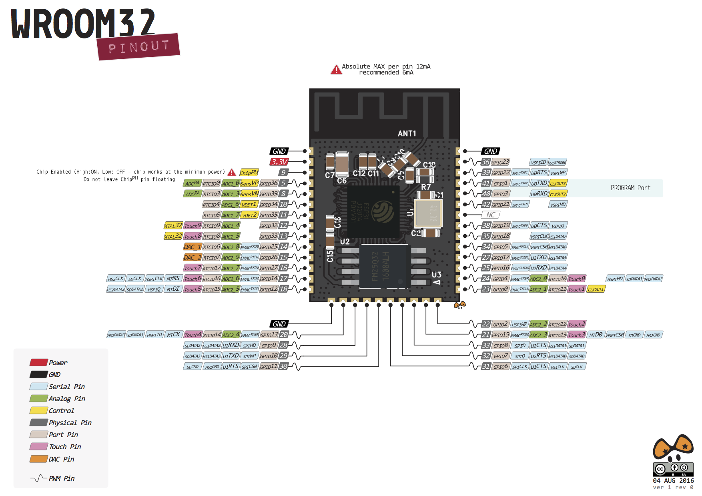

# Basic Functions that can be used with ESP32

ESP32 uses many functions that are very similar to many arduino boards, the only difference is that some parameters have to be changed according to the hardware limitation of this board.


## Pinout diagram




## Basic functions

The pins of ESP32 is connected to various connectors of IOT-A-SYNC, verify it before starting Some of the basic functions that can be used are given below:

### [pinMode](https://www.arduino.cc/reference/en/language/functions/digital-io/pinmode/)

This function lets the controller know weather the GPIO pin will act as Input or Output.

### [digitalWrite](https://www.arduino.cc/reference/en/language/functions/digital-io/digitalwrite/)

This command instructs a particular GPIO pin to go logic HIGH or logic LOW as per the arguments.

```cpp

digitalWrite(GPIO_pin_number,HIGH); //This gives logic HIGH (3.3V)
digitalWrite(GPIO_pin_number,LOW); //This gives logic LOW (0V)

```

### [digitalRead](https://www.arduino.cc/reference/en/language/functions/digital-io/digitalread/)
  
This command checks the digital logic voltage at a particular pin specified as arguments. It returns a boolean TRUE if logic detected is HIGH at that pin and FALSE if logic LOW is detected.

```cpp
digitalRead(GPIO_pin_number);
```

### [analogRead](https://www.arduino.cc/reference/en/language/functions/analog-io/analogread/)
  
This reads the analog value at the pin specified as argument. Since it has 12bit ADC (analog-to-digital convertor) it can only read voltages in discrete intervals of 2^8 (i.e 2^(no. of bits)), therefore it can read upto an accuracy of 3.3/(2^8) = 0.805mV.

```cpp
analogRead(GPIO_pin_number);
```

### Writing Ananlog values

ESP32 does not have [analogWrite()](https://www.arduino.cc/reference/en/language/functions/analog-io/analogwrite/) function. So we use different methods to generate analog signals. One such method is using PWM and other is using the inbuilt DAC hardware.

#### Using DAC
  DacWrite(GPIO_pin,value);
  //'value' defined ranges from 0 to 4095 as it uses a 12 bit DAC.

#### Using PWM

  Here we use the concept that in a pulsed wave the average output is (max Voltage)X(duty cycle). Thus this method can be used to vary the brightness of an LED, vary the sound in a speaker, vary the speed of motors and many more.

  For this, we define a particular frequency with which we want to send PWM (For lighting LEDs it should be much higher than the persistence of vision, for motors it should be according to the time constant). The duty cycle can be varied by keeping the output HIGH for some time and LOW for the rest of the time. See [this example](https://github.com/MrityunjaiKumar/Design_and_Practicum_workshop-DPW100-/blob/master/Software/Examples/On_Board_Peripheral_Examples/PWM/PWM.ino) to get an overview on how to code for PWM.

### [delay()](https://www.arduino.cc/reference/en/language/functions/time/delay/)

This function lets the controller to wait for certain millisecons (as specified in the argumenmt) before executing the next instruction. When the delay is executed, the controller cannot do any other task, it’s like being in a ‘paused’ state.

```cpp
delay(1000); //delay of 1000ms i.e.1sec
```

Similar function is [delayMicroseconds()](https://www.arduino.cc/reference/en/language/functions/time/delaymicroseconds/).
[Millis()](https://www.arduino.cc/reference/en/language/functions/time/millis/) - This function returns the time in milliseconds that have been passed since program execution has started. It has overflow time of about 50 days!

### Interrupts

Interrupt is a signal emitted by hardware or software when a process or an event needs immediate attention. It alerts the processor to a high priority process requiring interruption of the current working process. In I/O devices one of the bus control lines is dedicated for this purpose and is called the Interrupt Service Routine (ISR).

When a device raises an interrupt at lets say process i, the processor first completes the execution of instruction i. Then it loads the Program Counter (PC) with the address of the first instruction of the ISR. Before loading the Program Counter with the address, the address of the interrupted instruction is moved to a temporary location. Therefore, after handling the interrupt the processor can continue with process i+1.

Interrupts here can be callled in four ways/Modes:-

LOW to trigger the interrupt whenever the pin is low,
CHANGE to trigger the interrupt whenever the pin changes value
RISING to trigger when the pin goes from low to high,
FALLING for when the pin goes from high to low.

**All GPIO pins can be configered as Interrupt pins**

### [attachInterrupt()](https://lastminuteengineers.com/handling-esp32-gpio-interrupts-tutorial/) 

This tells the controller on which pin the interrupt has to be attached and what ISR does it corresponds.
  attachInterrupt(GPIO_Pin_no, ISR, Mode);

```
//'ISR' is a function which is called when interrupt is received. ISR has to be as small as possible.
//'Mode' specifies the event when interrupt should be called.
```

detachInterrupt(pin_no) It disables the interrupt at that pin.
Serial Class
This is a class predefined in the “Arduino.h” library for serial communication. It consists of many functions which are used for manipulating data. This has extreme importance in UART communication.

Visit: [https://www.arduino.cc/reference/en/language/functions/communication/serial/](https://www.arduino.cc/reference/en/language/functions/communication/serial/) to know more about functions available in this class.

