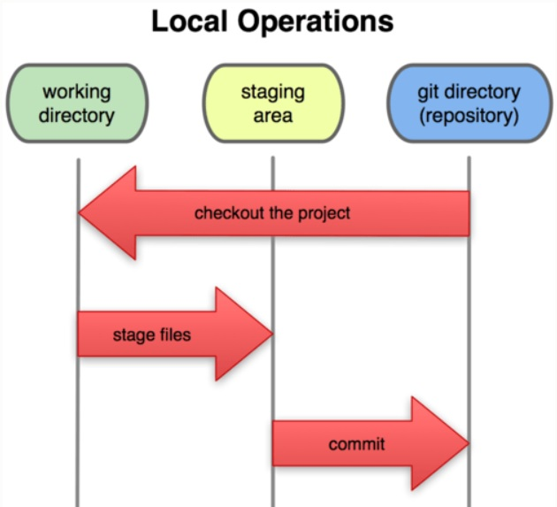
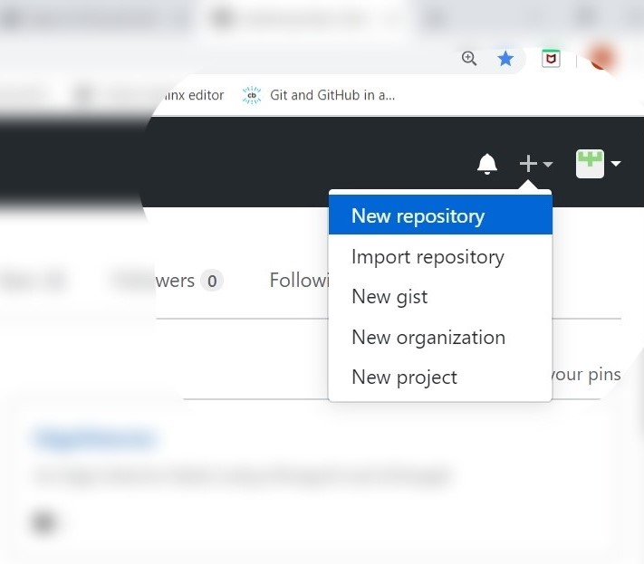
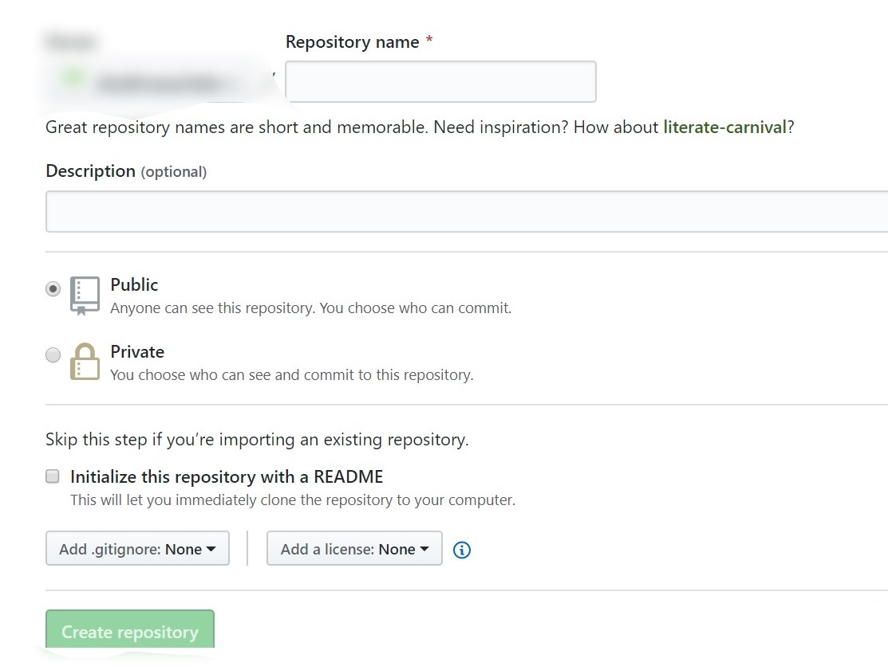
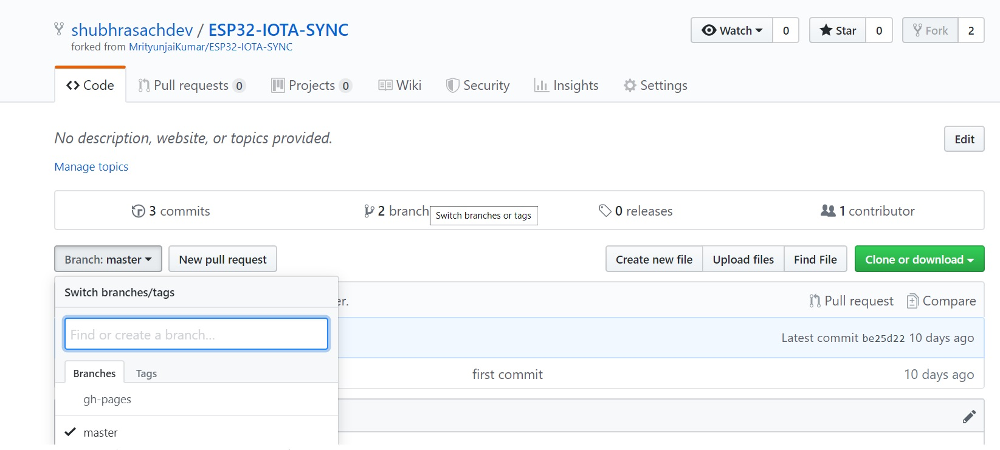
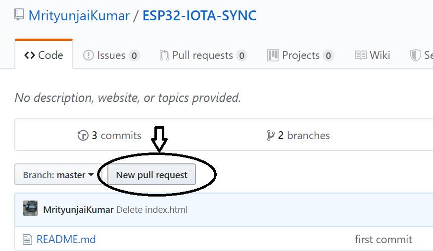
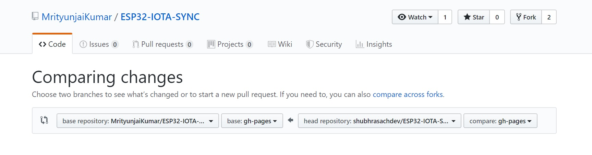
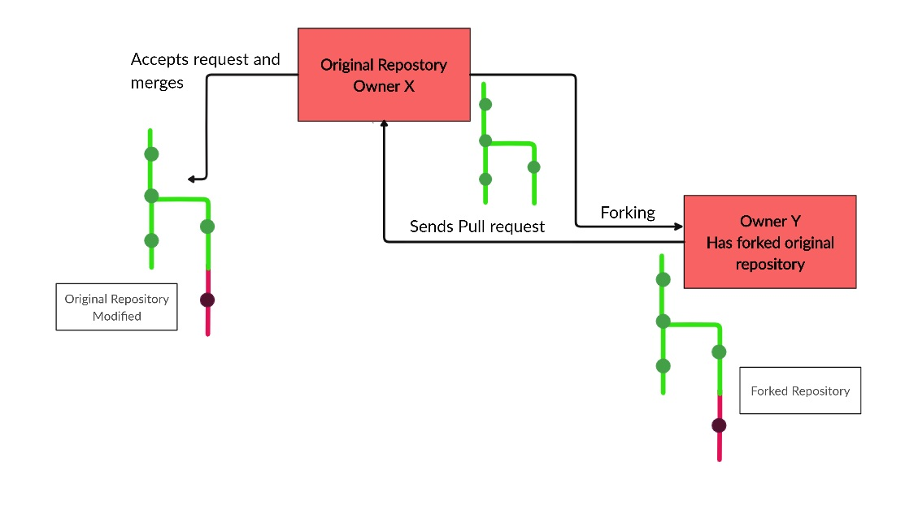

# Basics Of Git and GitHub

Git is a distributed version control tool that a developer installs locally on their computer, that can manage a development project’s source code history, while GitHub is a cloud based platform built around the Git tool. GitHub is an online service that stores code pushed to it from computers running the Git tool. Here, we will learn and master all the basics of Git and GitHub.

## Git Installation

### For Windows
To download and install Git for Windows, go to this link. This will download the installer. Run the installer, and go along with the default installation settings. Once installation completes, the Git commands can be run from the Command Prompt or Windows Powershell.

### For Linux
On the Linux terminal, run the following command-

```
> sudo apt-get install git
```

### Configuration
Git for Windows provides an application called Git Bash, which provides an emulation layer for Git command line experience. In order to use it, simply launch the Git Bash application. To use Git commands for a specific directory, navigate to the destination by using the change directory command. Alternatively, open the destination folder, right click and select the ‘Git Bash Here’ option from the menu.

After installation, it is ideal to run the following commands from Git Bash to provide configuration information-

```
$ git config --global user.name "user-name"
$ git config --global user.email "user-email"
```

## Basic Git Commands
Before we move on to Git commands, it is crucial to understand how the process of using Git actually works. Essentially, when you save the current state of your project in Git, it takes a snapshot of what your project looks like at that very instant. Since we can save many versions of the same project in Git, if we encounter an error during the course of development, it is possible to revert back to the last version of the project that worked, using Git. This eliminates the time and energy that we would otherwise have spent in starting all over.
Git has 3 states your files can reside in:

- Committed means that the data is safely stored in the local database.
- Modified means that the files have been changed but not committed yet.
- Staged means that the files have been marked in their current version, and can be committed.

The project resides in our local directory or repository. When we make changes to files in such a directory, the files are said to have been ‘modified’. When we stage a file, we add a snapshot of it to the staging area. Once we commit such a file, it’s snapshot from the staging area is saved permanently in the Git directory.



Use the git init command to create a new Git repository from a working directory on the system. On the Git Bash, navigate to the working directory, and run the following-

```
$ git init
```

After this, add the files to the staging area.

```
$ git add .
```

to add all the files in the working repository
OR

```
$ git add filename
```

to add a specific file.
Now, these files are present in the staging area. In order to commit them to the Git directory, run the following command-

```
$ git commit -m "MESSAGE"
```

The message string should preferably be something that neatly sums up the changes that have been made, making the version more recognizable.

## Git and GitHub basic commands

As discussed earlier, GitHub is an online cloud service built around Git Tools. It makes it extremely convenient for developers to collaborate and share repositories, codes, etc. It has powerful features like pull, merge and fork, which facilitate collaboration.
To use Github, first set up a GitHub account. Next, create a new repository.




Add in the details, like the name, description etc., and create the repository.
Once this is done, we need to establish a remote connection between the GitHub repository that we have just created, and the Git Repository on our system. To do this, run the following command-

```
$ git remote add remote-name github-repository-url
```

Replace the remote-name with a name of your choice, and the github-repository-url with the url of the repository you want to add a remote connection to.
Next, we push the files in our git directory to this GitHub repository.

```
$ git push remote-name branch-name
```

A branch name can be specified if the files have to be pushed to a branch other than the master branch.
Branching of GitHub Repositories Branches are used to isolate work without affecting other branches. It can be used to develop new features, fix bugs, and experiment with new ideas.
In order to create a branch, simply navigate to the main page of the repository and click the branch selector menu. There, enter the name of the branch you wish to create.



When we have a project with multiple branches, sometimes we need to work in the branches other than master. To do this, run the following command from Git Bash-

```
$ git checkout branch-name
```
### Cloning a GitHub Repository
To clone a GitHub Repository in your system, run the following command and replace the repository-url with the url of the repository you wish to clone-
```
$ git clone repository-url
```
### Forks and Pull Requests
To fork someone else’s GitHub Repository to your account, first go to the repository you wish to fork, and click the ‘Fork’ option.


Forking will create your own version of the desired repository. Any changes that you make and commit will reflect in your forked version of the repository, and not the original.
However, there is a mechanism in place, which allows you to request the original owner of the repository to include the changes you have made and incorporate them in their repositories, if they so see fit. This is called sending a pull request.



Choose the compare across forks option. On the left, select the repository and it’s branch that you wish to merge with, and on the right, select the repository and the branch you want to merge to the original repository. Pull requests can also be made across branches of the same repository.


Once you select the repositories, GitHub will verify if they can be merged. If so, it will open up a menu for you to fill details about the pull request in. You can specify a title, detailed description etc. Once these details are filled, click on ‘Create a Pull Request’. A request will be sent to the owner of the first repository to review the changes. If approved, your repository will be merged with the original.



For further reference, visit:
[https://git-scm.com/book/en/v1/Getting-Started-Git-Basics](https://git-scm.com/book/en/v1/Getting-Started-Git-Basics)

[https://codeburst.io/git-and-github-in-a-nutshell-b0a3cc06458f](https://codeburst.io/git-and-github-in-a-nutshell-b0a3cc06458f)