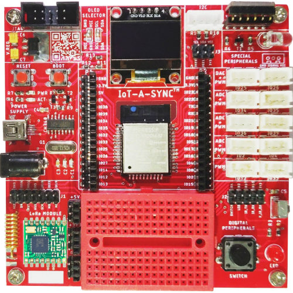

# Welcome to IOT-A-SYNC Documentation

This is the documentation for the IOT-A-SYNC board. 

## What is IOT-A-SYNC?

IOT-A-SYNC is rapid prototyping development board for Internet of Things (IOT) applications. 
This board is powered by ESP32 sytem on chip microcontroller with Xtensa dual-core.
Esp32 officially supports Arduino and ESP-IDF framework built around FreeRTOS.

### NIC Interfaces available on IOTA-SYNC
IOT-A-SYNC supports multiple globally accepted network interfaces for IOT devices communication.
Various wireless communicaton options it supports are WIFI, BLE,NFC, LoRa PHY.  

### NIC Interfaces in terms of range

In terms of range of commuincation, 
For Short range, it supports NFC. 
For Medium range, it supports Wi-Fi (802.11 b/g/n) and  Bluetooth (v4.2 BR/EDR and BLE). 
For Long range, it supports LoRa communication.

### Topolgy of network that can be demonstrated  

IOT-A-SYNC also support network topology like Star and Mesh for creating Wireless sensor network(WSN).

### Programming and Debugging interfaces available
Programming of IOT-A-SYNC is supported by onboard USB-to-Serial converter as well as it also 
supports external JTAG interface for programming and debugging. 

### On board preipherals
Other on board peripherals that are available icludes:-
On-Board Led, Switch, Oled(128x64) screen, BME280 sensor (provides Temperatue, Humidity, Pressue), 
IR transmitter led and IR Receiver sensor.

All I/O pins are provide on 0.1" male as well as female header, as well as few distictive feature I/O are 
available on 3 Pin JST connector compatible with commonly available sensors and other modules. 
The 180-point breadboard further facilitates temporary/external circuit testing via jumpers on board itself.

### Low power mode

Also, for low power WSN, shorting jumpers are provided to limit power usuage.

## Some example code repository

URL for ESP32-IOTA-SYNC repository: [ESP32-IOTA-SYNC](https://github.com/MrityunjaiKumar/ESP32-IOTA-SYNC.git)

URL for Design and Practicum Workshop: [DPW](https://github.com/MrityunjaiKumar/Design_and_Practicum_workshop-DPW100-)
